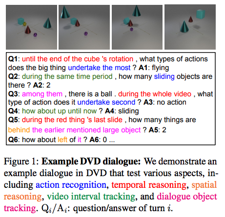

# DVD: A Diagnostic Dataset for Multi-step Reasoning in Video Grounded Dialogue
This repo contains the code for the paper 

**DVD: A Diagnostic Dataset for Multi-step Reasoning in Video Grounded Dialogue**   
[Hung Le](https://scholar.google.com/citations?hl=en&user=jnYI1UgAAAAJ), [Chinnadhurai Sankar](https://scholar.google.com/citations?user=KynAS2gAAAAJ&hl=en), [Seungwhan Moon](https://scholar.google.com/citations?user=HJTLcDsAAAAJ&hl=en), [Ahmad Beirami](https://scholar.google.com/citations?user=VuKWbMMAAAAJ&hl=en), [Alborz Geramifard](https://scholar.google.com/citations?user=5tT42pwAAAAJ&hl=en), [Satwik Kottur](https://scholar.google.com/citations?user=iQxXG8kAAAAJ&hl=en)   
[[ArXiv](https://arxiv.org/abs/2101.00151)].   
_Annual Meeting of the Association for Computational Linguistics (ACL), 2021_

# Abstract 
A video-grounded dialogue system is required to understand both dialogue, which contains semantic dependencies from turn to turn, and video, which contains visual cues of spatial and temporal scene variations. Building such dialogue systems is a challenging problem, involving various reasoning types on both visual and language inputs. Existing benchmarks do not have enough annotations to thoroughly analyze dialogue systems and understand their capabilities and limitations in isolation. These benchmarks are also not explicitly designed to minimise biases that models can exploit without actual reasoning. To address these limitations, in this paper, we present **DVD**, a **D**iagnostic **D**ataset for **V**ideo-grounded Dialogues. The dataset is designed to contain minimal biases and has detailed annotations for the different types of reasoning over the spatio-temporal space of video. Dialogues are synthesized over multiple question turns, each of which is injected with a set of cross-turn semantic relationships.  We use DVD to analyze existing approaches, providing interesting insights into their abilities and limitations. In total, DVD is built from 11k CATER synthetic videos and contains 10 instances of 10-round dialogues for each video, resulting in more than 100k dialogues and 1M question-answer pairs. 

<p align="center">


If you find this code useful, consider citing our work:
```
@article{DBLP:journals/corr/abs-2101-00151,
  author    = {Hung Le and
               Chinnadhurai Sankar and
               Seungwhan Moon and
               Ahmad Beirami and
               Alborz Geramifard and
               Satwik Kottur},
  title     = {{DVD:} {A} Diagnostic Dataset for Multi-step Reasoning in Video Grounded
               Dialogue},
  journal   = {CoRR},
  volume    = {abs/2101.00151},
  year      = {2021},
  url       = {https://arxiv.org/abs/2101.00151},
  archivePrefix = {arXiv},
  eprint    = {2101.00151},
  timestamp = {Thu, 21 Jan 2021 14:42:30 +0100},
  biburl    = {https://dblp.org/rec/journals/corr/abs-2101-00151.bib},
  bibsource = {dblp computer science bibliography, https://dblp.org}
}
```
	
	
#  Dataset
The dataset can be downloaded [here](https://drive.google.com/drive/folders/1QxMZuDviyqf3yQ1r49Eqlgd07-VQzDeh?usp=sharing). The shared drive contains 2 zip files: *dvd_dialogues*, containing all dialogues of training, validation, and test split, and *dvd_resnext101*, containing the extracted ResNext101 features of all CATER videos (the features are extracted based on the best performing model pretrained on Kinetics [here](https://github.com/kenshohara/video-classification-3d-cnn-pytorch)). Please refer to the `dvd_codebase` folder in this repo to load and batch data (See Structure and Scripts below for more information).
The dataset statistics of DVD are:
| Split     | #Videos | #Dialogues | #Questions | # Unique Questions |
|-----------|---------|------------|------------|--------------------|
| DVD-Train | 6,157   | 61,551     | 615,510    | 360,334            |
| DVD-Val   | 1,540   | 15,396     | 153,960    | 99,211             |
| DVD-Test  | 3,299   | 32,978     | 329,780    | 200,346            |
| DVD-Total | 10,996  | 109,925    | 1,099,250  | 620,739            |


#  Structure

The codes were built upon the codebase from [CLEVR](https://github.com/facebookresearch/clevr-dataset-gen). Thank you the authors for sharing!. 

The repo contains the following:

- `cater_preprocessing`: data preprocessing of CATER videos
    - `download.sh`: script to download the original CATER dataset (max2action and all_actions splits)
    - `update_scene.py`: update scene graph information from CATER original scene json files
    - `utils.py`: functions on scene graphs, e.g. precompute filter options of objects, spatial relationships, video intervals
- `dvd_generation`:  generation of dialogues/QA based on video annotation created from `cater_preprocessing`
    - `generate_dialogues.py`: main code to simulate dialogues
    - `run.sh`: script to run `generate_dialogues.py` with setting parameters
    - `filters`: filter functions to construct valid questions
        - `dialogue_filters.py`:  filter functions to simulate dependencies over turns
        - `scene_filters.py`: manage filter functions 
        - `spatial_filters.py`: filter functions for valid object attributes
        - `temporal_filters.py`: filter fuctions for valid object actions 
        - `constraint_filters.py`: check constraints by question types e.g. `NO_NULL` = no empty attribute value
    - `question_templates`:  contain predefined question templates, synonyms, and metadata json files. Many of the question templates are built upon templates from CLEVR.
        - `add_action_attribute.py`: add action as an attribute in each object e.g. "the moving cube"
        - `add_atomic_action_query.py`: add new question templates for query of intervals with atomic actions (e.g. object with max. 1 action)
        - `add_compositional_query.py`: add new question templates for query of intervals with compositional actions (e.g. object with max. >1 action)
        - `add_cater_constraints.py`: add new constraint that is specific to CATER e.g. object containment constraint (only cones can contain other objects) 
        - `add_dialogue_constraints.py`: add new constraint to make questions compatible in a dialogue e.g. question contains potential reference candidates 
        - `add_other_templates.py`: add new question templates e.g. question about an action based on the action's order
        - `create_templates.sh`: run all the above steps
    - `simulators`: process logical programs to obtain ground-truth answers and generate question sentences in natural language form
        - `template_dfs.py`: traverse through execution tree of program layouts
        - `question_engine.py`: manage logical functions 
        - `spatial_question_engine.py`: implement logical spatial-based functions e.g. object count, object exist, etc.
        - `temporal_question_engine.py`: implement logical temporal-based functions e.g. action filter, action count, etc. 
        - `question_generator.py`: generate question sentences
    - `utils`: commonly used scripts
        - `configs.py`: set up script parameters e.g. directory, number of templates per video, etc.
        - `data_loader.py`: load data, including metadata, synonyms, templates, CATER files, etc.
        - `dialogue_utils.py`: functions on simulated dialogue turns with linguistic dependencies 
        - `scene_utils.py`: functions on scene annotation e.g. spatial relations
        - `utils.py`: other common functions
        - `global_vars.py`: global variables e.g. acdtion mapping, action nouns/verbs
 - `dvd_codebase`: basic function to load DVD dataset 
	 - `main.py`: main process to load videos, dialogues, vocabulary, and create batches 
	 - `run.sh`: script to specify parameters, data and output directories 
	 -  `configs/configs.py`: setting parameters 
	 - `data`: basic functions to handle data and batch files 
		 - `data_handler.py`: functions to load dialogues, videos, and create vocabulary
		 - `data_utils.py`: basic functions to support data loading and preprocessing
		 - `dataset.py`: definition of Dataset and Batch class
         - `analysis_utils.py`: functions to analyze output results e.g. by question types, question subtypes, transfer accuracy, etc. 
#  Scripts
Following these steps to preprocess CATER videos: 
1. `cd cater_preprocessing`
2. Run `./download.sh` to download CATER videos into `cater_preprocessing` folder 
3. Create video annotation from CATER files by running `python update_scene.py --cater_split <split> --scene_start_idx <start index> --scene_end_idx <end index>`

Following these steps to simulate dialogues and generate annotations:
1. `cd dvd_generation`
2. Optional: recreate question templates by running `./question_templates/create_templates.sh`. You can skip this step and directly use the question templates in this repo. 
3. Generate dialogues and annotation by running `./run.sh <cater split> <start index> <end index> <output directory> <train/val/test split>`. Please change the `project_dir` to the root directory of this repo and `cater_dir` to the preprocessed CATER video directory from above. 

Following these steps to load and batch the dataset: 
1. `cd dvd_codebase`
2. Load DVD dataset and create batches by running `./run.sh <gpu device id> <1 if debugging with small data else 0>`. Please change the parameter `data_dir` and `fea_dir` to the data and feature directories (e.g. unzipped location of *dvd_dialogues* and *dvd_resnext101*)

# Data Exploration 
We created a [notebook](https://github.com/facebookresearch/DVDialogues/blob/master/notebooks/explore_data.ipynb) in this repo to demonstrate how different annotations can be extracted from DVD dialogues. Specifically, we used an example CATER video and DVD dialogue and defined helper functions to display various annotation details, e.g. question types/subtypes, tracked objects, tracked intervals, etc. 

- Each DVDialogue json file contains one dialogue for a specific video from CATER. All object ids/actions and frame ids are referenced from the annotations of the CATER video. 
- Each dialogue has 10 turns. In each turn, the data is a dictionary with the following attributes: 
    - `question`: a question about the video
    - `answer`: an answer to the above question based on the visual content of the video 
    - `turn_dependencies`: the cross-turn dependencies that are embedded in this turn. The 1st turn of each dialogue always have `none` type dependencies (no cross-turn relations) 
        - `temporal`: relations that determine the video interval of the current turn, including: 
            - `<1/2/3/4>_<flying/sliding/rotating>_among_<before/after/during>`: action reference to a set of action in the previous turn e.g. "among them, after the third slide" 
            - `prior_<flying/sliding/rotating>_<before/after/during>`: action reference to a unique action in the previous turn e.g. "during this slide"
            - `after`/`before`/`during`: interval references to the interval of the previous turn e.g. "after this period" 
            - `video_update`: topic transfer (temporal) with incremental video input to the video input of the previous turn e.g. "what about up until now"
            - `earlier_unique_obj_none`: interval with long-term object references e.g. "during the aforementioned yellow thing 's first rotation"
            - `last_unique_obj_none`: interval with short-term object references e.g. "before its third rotation"
        - `spatial`: topic transfer (spatial) from the previous turn, including: 
            - `left` / `right`/ `front`/ `behind` e.g. "what about to the left of it?"
        - `attribute`: topic transfer (attribute) from the previous turn, including: 
            - `query_color`/ `query_shape`/ `query_size`/ `query_material` e.g. "what about its color?" 
        - `object`: object references to objects mentioned in dialouge context, including:  
            - `earlier_unique`: long-term object references (> 1 turn distance) e.g. "the earlier mentioned red sphere"
            - `last_unique`: short-term object references (1-turn distance) e.g. "them", "it"
    - `program`: the functional program that is used to solve the question in a multi-step reasoning process. This is a sequence of node, each node including the following attributes: 
        - `type`: type of nodes e.g. `filter_color`, `count_object`, etc. 
        - `inputs`: indices of the preceding nodes; their outputs are inputs to the current node 
        - `side_inputs`: parameters of the current node e.g. "green", "yellow", "rubber", "before", "after", etc. 
        - `_output`: the output of the current node e.g. object count, object ids, interval period by start/end frame id 
        - Please refer to the Appendix in the paper for more details of functional program types and data types 
    - `template`: template of the question, containing the information to determine the question interval type and question type/subtype. Other information includes: 
        - `cutoff`: the cutoff event from the original CATER video. The input video of this turn will be from frame #0 to the cutoff event
        - `used_periods`: contains all time periods up to the current turn. Each period is determine by a start event and end event 
        - event: each cutoff event or start/end event is defined as by the start/end time of an object action. Event is in the form of `[<object_id>,start/end_rotating/sliding/flying, <order>, <frame id>]`
        - if an event is `None`, it is either the start or the end of the original CATER video 
        - `used_objects`: all unique objects that are mentioned up to the previous turn. This is used to solve any long-term object references in the question of the curren turn. This is a dictionary with key as the object id and the values are:
            - `original_turn`: the original turn id the object was mentioned 
            - object attributes mentioned in the dialogue so far: `<Z>`: size, `<C>`: color, `<M>`: material, `<S>`: shape 

# License
This project is licensed under the license found in the LICENSE file in the root directory of this source tree.
